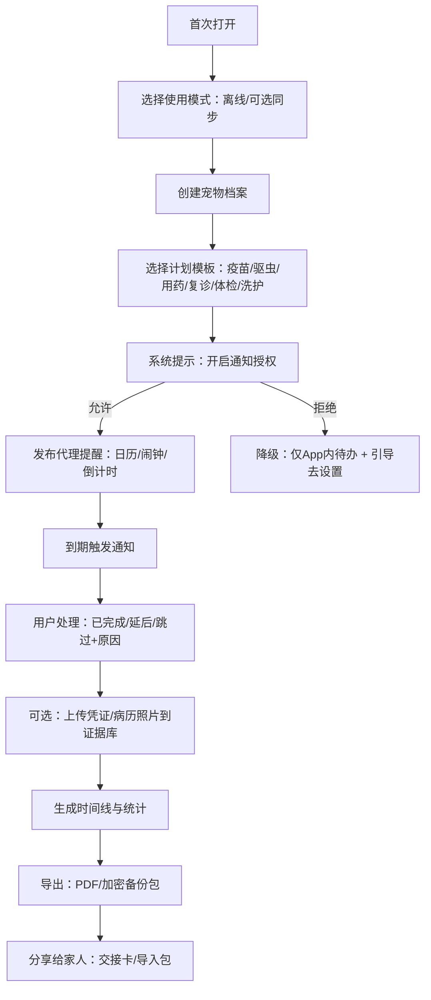

# 面向多数人的宠物关怀工具 App（HarmonyOS）产品需求文档 PRD

## 执行摘要与关键决策点

本 PRD 定义一款**面向“多数人”的 C 端宠物关怀工具**，以 **鸿蒙 HarmonyOS（已指定）** 为唯一开发平台，强调**本地离线能力**（提醒、档案、病历与证据存储、家庭共享、导出），并**明确不做任何第三方服务/供给侧能力**（不做商家入驻、不做在线预约/撮合、不做第三方服务交易）。这一边界将产品从“宠物电商/服务平台”赛道里抽离出来，更贴近“日常高频、零门槛、低干扰”的工具价值。

市场与用户侧关键事实与启示（用于产品定位与功能取舍）：
- 中国城镇犬猫消费市场规模在 2024 年达到约 **3002 亿元**，城镇犬猫数量约 **12411 万只**、城镇宠主（犬猫主人）约 **7689 万人**，且犬猫仍为主流饲养类型。citeturn12view1  
- 宠主结构呈年轻化与高学历特征：2024 年 **90 后占比 41.2%**、**00 后占比 25.6%**；本科及以上占比可达 **73.6%**。citeturn26view3  
- 宠物消费结构中，“食品”和“医疗”占比高，医疗约占 **28.0%**；意味着**疫苗/用药/就诊相关的记录、提醒与证据保存**长期存在刚需。citeturn12view1  
- 宠物信息触达以短视频与社区种草为主：2024 年短视频平台触媒偏好约 **73.5%**、小红书约 **66.1%**。可用于后续增长策略（内容传播与可分享资产）。citeturn13view0  
- 工具类应用面临“时间被大生态吞噬”的竞争环境：截至 2025 年 12 月，移动互联网 MAU 约 **12.76 亿**、人均单日使用时长约 **7.96 小时**；垂类工具要靠“强触发（提醒）+ 强回流（卡片/桌面入口）”保留存在感。citeturn10search1  

HarmonyOS 平台能力决定的关键技术策略（直接影响 MVP 可行性与体验）：
- 提醒能力优先采用 **后台代理提醒（Agent-powered Reminder）**：应用退到后台或进程终止后，系统仍可代理执行定时提醒（倒计时/日历/闹钟）。citeturn28search4turn16search8  
- 代理提醒涉及权限与开放能力：需申请 **ohos.permission.PUBLISH_AGENT_REMINDER**（系统授权权限），并按指引在 AppGallery Connect 进行“开放能力管理/代理提醒”申请，同时在功能前置时机请求通知授权。citeturn28search2turn28search7turn16search1  
- 通知需显式向用户请求授权：发布通知前调用 **requestEnableNotification()** 请求通知开关授权。citeturn3search1turn3search5  
- 提升留存的“鸿蒙特性入口”优先使用**服务卡片（Service Widget）**：在应用/元服务中提取“及时、核心、实用”的信息与操作，降低打开 App 成本。citeturn15search0turn0search6  
- 数据同步策略以“本地优先、可选跨设备”设计：同应用跨设备数据同步可利用鸿蒙分布式数据能力（ArkData/Distributed Data Sync）。citeturn3search2  

未指定项（必须显式标注）：
- 目标国家/地区：**未指定**（合规章节默认以中国大陆法律与监管要求为基线，若目标市场不同需重做合规矩阵）。citeturn21view1turn24search1  
- 预算上限：**未指定**（下文给出 MVP/主流/旗舰三档预算区间与估算方法）。citeturn22search1turn22search9  

关键决策点（结论式，可直接给研发/合规执行）：
- **产品边界**：仅做 C 端本地关怀工具；所有“商家/医院/寄养/美容预约撮合、在线问诊、线上购药、活体交易”均为范围外（Out of Scope）。该边界同时降低医疗合规与交易风控复杂度。citeturn10search2turn19search0  
- **隐私策略**：默认支持“无账号/离线使用”，尽量不采集个人信息；导入图片与文件优先使用系统 Picker，避免申请全量相册/存储权限，符合“最小必要”。citeturn34search2turn21view1turn27view0  
- **提醒可靠性优先**：MVP 以“代理提醒+通知授权引导+到期确认”闭环为核心；卡片为次优先，分布式同步为后置增强。citeturn28search4turn15search0turn3search2  

## 目标、背景与范围

### 产品目标

本产品旨在帮助“多数宠主”完成三件事：
1) **不再错过关键节点**：疫苗、驱虫、用药、复诊、洗护、体检等，以高可靠提醒体系降低遗忘成本。citeturn14view1turn12view1  
2) **把重要资料集中可用**：宠物档案、免疫记录、费用与处方、化验单、影像、照片等，支持离线保存、加密与导出，形成“可随时拿得出手的证据包”。（“免疫档案”与可追溯要求在动物防疫体系中被强调。）citeturn36view0turn12view1  
3) **家庭/代养协作**：在不引入供给侧的前提下，实现“可分享的关怀信息”与“交接卡/导出包”，降低多照护者沟通成本。citeturn13view0turn10search1  

### 背景与机会点

- 用户规模与支出基础：城镇犬猫宠主规模与市场体量已形成（宠主约 7689 万、市场规模约 3002 亿元）。citeturn12view1  
- 医疗相关支出占比高（约 28%），叠加“预约便捷性、服务专业性、环境”等关注度提升，说明“健康管理与计划性”需求持续增强；即便本产品不做预约撮合，也应覆盖“自建预约/复诊提醒、就诊资料整理”。citeturn12view1turn14view1  
- 信息获取渠道以短视频/社区为主，天然适配“可分享的工具型内容资产”（如：疫苗清单 PDF、代养交接卡、紧急联络卡）用于传播。citeturn13view0  

### 范围定义与变更说明

#### In Scope（本 PRD 范围内）
- 宠物档案（基础身份信息、过敏/禁忌、紧急联系人、行为与喂养偏好）  
- 计划与提醒（疫苗/驱虫/用药/复诊/体检/洗护等模板 + 自定义）  
- 病历/票据/证据存储（图片/文件离线归档、标签、搜索、加密）  
- 家庭共享（离线导出分享包/交接卡；可选同账号多设备同步）  
- 导出与打印（导出 PDF、导出加密备份包、打印）  
- 离线可用（核心功能无网可用；联网仅用于可选更新/分析）  

#### Out of Scope（明确不做）
- 第三方服务与供给侧：商家入驻、在线预约/支付、服务撮合、第三方电商、在线问诊、药房、保险等。  
- 活体交易与引流：任何形式的“买卖宠物/活体邮寄”信息撮合或广告投放。相关消费纠纷与风险在公开报道中非常突出，本项目主动规避。citeturn19search0turn19search4  

> 说明：用户在需求中提到“预约、服务商”数据模型。本 PRD 将其改造为**“自建预约（仅提醒）”**与**“自定义服务商联系人名片（非入驻、非撮合）”**，满足字段设计需要，同时不违背“无供给侧”的约束。

### 目标国家/地区、平台与预算上限

| 维度 | 结论 |
|---|---|
| 目标国家/地区 | **未指定**（合规与上架默认按中国大陆监管与应用市场规则执行；若出海需重做 GDPR/CCPA 等适配，未在本 PRD 覆盖）citeturn21view1turn24search1 |
| 开发平台 | **鸿蒙 HarmonyOS（已指定）**：建议采用 ArkTS + ArkUI（Stage 模型）并面向华为应用市场发布流程设计。citeturn3search12turn23search1turn23search0 |
| 预算上限 | **未指定**（下文提供三档方案预算区间与估算方法，基于国家统计局平均工资口径进行人力测算）citeturn22search1turn22search9 |

## 用户画像与关键场景

### 目标用户画像表

本产品“多数人”画像以城镇犬猫宠主为主，并兼顾异宠（作为可选扩展）。宠主的年龄、收入、城市线级与宠物类型数据来自行业白皮书摘录。citeturn26view3turn12view1  

| 画像维度 | 主流画像（多数人） | 证据/备注 |
|---|---|---|
| 年龄 | 90 后为主（41.2%），00 后快速增长（25.6%），80 后约 26.5%，70 后及以前合计不足 10% | 行业白皮书对 2024 年宠主年龄分布统计。citeturn26view3 |
| 城市/乡镇 | 一线 32.5%，二线 42.5%，三线及以下 25.0%；乡镇/农村：**未指定** | 白皮书给出城市线级分布；未提供乡镇口径。citeturn26view3 |
| 养宠类型 | 犬占比约 57.0%，猫占比约 64.3；异宠（爬行/水族/啮齿/鸟类）占比上升 | 多宠/多类型并存（统计呈多选结构）。citeturn12view1 |
| 收入/付费意愿 | 月收入集中在 4000~9999 元，其次 10000~14999 元；纯“付费意愿”口径：**未指定** | 收入分布来自白皮书；付费意愿需另做调研。citeturn26view3turn12view1 |
| 技术熟练度 | **中高（推定）**：智能手机高频使用；但需要“低学习成本”设计 | 移动互联网使用时长高、生态竞争强，工具需低打扰。citeturn10search1 |

### 用户痛点（面向工具型“多数人”）

- 遗忘与错过：疫苗、驱虫、用药、复诊等属于“低频但高代价”事项；服务侧研究指出用户对“预约便捷性”的关注提升，反向证明计划与提醒的重要性。citeturn14view1turn12view1  
- 资料分散不可用：票据、免疫本、化验单散落在相册/聊天记录，关键时刻难以快速提供；法规层面强调免疫档案与可追溯。citeturn36view0  
- 多照护者协作成本：家庭成员、临时代养人需要同一套“喂养规则+紧急信息+到期事项”，但多数工具缺少“可交付的离线包”。（信息触媒以短视频/社区为主也意味着“可分享资产”更易传播。）citeturn13view0turn10search1  
- 隐私与权限敏感：监管趋势要求“按功能场景索要权限、不得提前索要”，并鼓励用系统框架完成文件选择以避免索要相册/存储权限。citeturn27view0turn34search2  

### 关键使用场景（用户故事）

- 场景 A：新宠到家的一周  
用户建立宠物档案 → 选择“猫/犬基础计划模板” → 开启通知授权 → 自动生成首年疫苗/驱虫/复诊提醒 → 将免疫证明拍照存入“证据库”。citeturn12view1turn28search4turn3search1  

- 场景 B：长期用药与复查  
用户创建“用药计划（每日/隔日/疗程）+复查日期” → 代理提醒准时触发 → 用户一键“已完成/延期/跳过并记录原因” → 复诊材料自动打包导出 PDF。citeturn28search4turn25search2  

- 场景 C：临时出差，家人代养  
用户生成“代养交接卡”（喂食量、禁忌、紧急联系人、下次提醒）→ 通过系统分享发送给家人（可选加密）→ 家人按卡片执行并在 App 内确认完成（如安装了同 App，可导入分享包）。citeturn25search3turn13view0  

- 场景 D：纠纷/维权需要证据  
用户将购粮票据、体检报告、费用清单等按时间线归档 → 导出“证据包”用于沟通或投诉；因活体/宠物消费纠纷在公开报道中较常见，证据留存具有现实必要性。citeturn19search0turn19search8  

## 功能清单与优先级

### 竞品要点对比摘要（不少于 8 款）

说明：本产品不做供给侧，但竞品多数包含电商/预约/服务网络；对比目的是识别“多数人工具需求”在现有产品中为何仍未被充分满足。评分/下载来自各应用商店页面；“是否供给侧”按其公开功能描述判断。citeturn30view3turn29view1turn8search0turn32view0  

| App | 核心定位（公开信息） | 供给侧/交易/预约能力 | 典型强项 | 与本 PRD 的关键差异 | 评分/下载（来源） |
|---|---|---|---|---|---|
| entity["company","小佩宠物","petkit iOS app"] | 智能硬件+宠物数据与社区；含 VIP 服务描述 | 有（硬件生态/服务咨询） | 硬件数据、自动化喂养/如厕监测、社区 | 偏“硬件生态”，非纯离线工具；权限/账号体系可能更重 | iOS 评分 4.9，6.6 万评分citeturn30view3 |
| entity["company","E宠-健康帮手","epet iOS app"] | 宠物电商/健康养宠综合 | 有（购物属性突出） | 商品与内容、可能收集较多数据字段 | 目标与本 PRD 不同；非离线优先工具 | iOS 评分 4.3，3687 评分citeturn29view1 |
| entity["company","波奇宠物","boqii iOS app"] | 社区+宠物用品商城 | 有（购物/社区） | 社区种草、电商闭环 | 工具属性不聚焦；离线证据库不是主线 | iOS 评分 4.4，1766 评分citeturn29view2 |
| entity["company","宠物家","petem iOS app"] | 线下护理服务+会员 | 有（门店服务） | 服务网络、会员制 | 与本 PRD“无供给侧”冲突 | iOS 评分 3.5，291 评分citeturn29view3 |
| entity["company","Rover","dog boarding platform"] | 遛狗/寄养撮合平台 | 强供给侧 | 大规模供需匹配、交易流程 | 本 PRD 明确不做撮合/预约 | Google Play：4.6★，500 万+下载citeturn8search0 |
| entity["company","Wag!","dog walking marketplace"] | 遛狗/看护撮合平台 | 强供给侧 | 服务撮合、即时下单 | 同上（范围外） | Google Play：3.2★，100 万+下载citeturn8search1 |
| entity["company","Chewy","pet e-commerce US"] | 宠物电商+订阅配送 | 强交易 | 复购与配送体系 | 本 PRD 不做电商/配送 | Google Play：4.8★，1000 万+下载citeturn8search2 |
| entity["company","PetDesk","pet health reminders"] | 健康提醒+与服务提供者连接 | 有（预约请求/服务方） | 提醒+就医记录 | 本 PRD 保留“自建提醒/记录”，去掉“连接服务方/预约请求” | Google Play：4.8★，100 万+下载citeturn32view0 |
| entity["company","11pets","pet care platform"] | 宠物护理平台（含企业版） | 有（企业版） | 提醒、文档、分享 | 本 PRD 更强调离线证据与无供给侧 | 功能描述含提醒/预约/记录citeturn31view1 |
| entity["company","Banfield Pet Hospital","veterinary hospital app"] | 连锁动物医院 App | 强供给侧 | 病历下载、提醒、在线问诊等 | 本 PRD 避免诊疗/在线问诊 | iOS 评分 4.8，11 万评分citeturn9search11 |

### 功能优先级矩阵（核心/次要/可选）

优先级原则：
- “多数人”优先：覆盖犬猫主流与多照护者；低学习成本。citeturn12view1turn26view3  
- 离线优先：核心链路不依赖网络；提醒必须可靠。citeturn28search4turn10search1  
- 最小必要与合规优先：尽量用系统 Picker、按场景申请权限，避免“通讯录/短信/后台定位”等敏感权限。citeturn27view0turn34search2turn21view1  

| 优先级 | 功能模块 | 功能点（摘要） | 选择理由 |
|---|---|---|---|
| 核心 | 宠物档案 | 多宠管理、基础信息、紧急联系人、过敏/禁忌、喂养偏好；“紧急卡”一键展示 | 多宠与犬猫为主流；紧急信息需随时可用。citeturn12view1turn36view0 |
| 核心 | 计划与提醒 | 模板（疫苗/驱虫/用药/复诊/体检/洗护）+ 自定义；代理提醒；到期确认；延后/跳过记录 | 预约便捷性关注提升，提醒闭环是工具价值核心；代理提醒保障后台可靠触发。citeturn14view1turn28search4 |
| 核心 | 证据库/病历 | 图片/文件归档、标签、搜索；离线存储；加密；时间线 | 医疗消费占比高，资料对就诊/维权重要。citeturn12view1turn19search0 |
| 核心 | 家庭共享（离线） | 生成“交接卡/分享包”（可读 PDF + 可导入数据包）；权限可控 | 多照护者协作；内容可分享也利于传播。citeturn13view0turn25search3 |
| 核心 | 导出/备份/打印 | 导出 PDF、导出加密备份包（本地）；打印；分享至系统面板 | 满足“可交付证据”；打印与分享为系统能力。citeturn25search2turn25search0turn25search3 |
| 次要 | 桌面入口 | 服务卡片展示“下一件事/今日待办”；一键完成/延后 | 降低打开成本，提高留存；卡片是鸿蒙系统特性。citeturn15search0turn0search6 |
| 次要 | 跨设备同步（同账号） | 同应用跨设备同步：宠物档案、提醒列表、完成状态（不强依赖云） | 满足多设备用户；可后置实现。citeturn3search2 |
| 次要 | 统计与习惯 | 完成率、漏做率、提醒命中率、用药疗程进度 | 为“多数人”提供可视化掌控，提升使用黏性。citeturn10search1 |
| 可选 | 实况窗/更强通知形态 | Live View（实况窗）展示“进行中疗程/倒计时” | 需要额外权益与推送体系，收益次于卡片；旗舰版可考虑。citeturn15search1turn15search7 |
| 可选 | 端侧 AI 辅助 | 证据自动分类、OCR 提取关键字段（疫苗日期等） | 需评估端侧模型体积与隐私影响；若涉及自动化决策需做 PIA。citeturn20view0turn21view1 |

## 用户旅程与交互流程

下图给出 MVP 关键旅程：从建档 → 计划模板 → 通知授权 → 代理提醒触发 → 完成闭环 → 证据归档 → 导出共享。其设计核心是“少步骤、强确定性”，并符合“按功能场景申请权限”。citeturn27view0turn28search4turn3search1  

交互要点（HarmonyOS 侧实现要求）：
- 通知授权：在 UIAbility 可交互后触发授权请求，调用 requestEnableNotification；拒绝后不应频繁弹窗骚扰，遵循“可关闭、可继续使用其他功能”。citeturn3search1turn27view0turn24search1  
- 代理提醒发布前置条件：已获得通知授权，并完成代理提醒开放能力/权限配置。citeturn28search2turn16search1  
- 完成闭环：通知落地页默认只给“完成/延后/跳过”三按钮，避免复杂表单；证据上传可后置为“可选步骤”。（减少摩擦以提升留存，符合工具类在高时长竞争环境的生存逻辑。）citeturn10search1  

## 信息架构、数据模型与接口概要

### 信息架构（IA）

建议采用 4 底栏结构（HarmonyOS ArkUI 实现）：
- 首页：今日待办/下一件事/快捷添加/紧急卡入口  
- 计划：模板库、时间轴、提醒列表、完成统计  
- 证据库：时间线、标签、搜索、导出  
- 我的：隐私与权限、备份/恢复、家庭共享、关于与合规说明  

“服务卡片”信息架构：仅展示**下一条提醒 + 一键完成/延后**，避免在卡片中承载复杂编辑。citeturn15search0turn0search6  

### 数据模型与权限说明（示例）

说明：本产品为离线优先，不强制后端；“API”在 MVP 阶段指**端内 Service/Repository 接口**。若后续需要云同步，可新增云端 API（未指定）。同时“预约/服务商”均为“用户自建/本地名片”。citeturn27view0turn21view1  

| 实体 | 核心字段（示例） | 典型权限/敏感性 | 访问控制（建议） |
|---|---|---|---|
| 用户 User | userId（本地生成 UUID）、settings（提醒偏好/主设备/加密开关）、familyMembers（可选） | 默认不需要个人身份信息；若引入账号体系将触发个人信息处理义务 | 默认本地；如“家庭共享导出包”仅导出最小必要字段citeturn21view1turn27view0 |
| 宠物档案 PetProfile | petId、昵称、物种（犬/猫/异宠）、品种（可选）、生日（可选）、体重、过敏/禁忌、照片 URI、紧急联系人（可选） | 可能包含个人联系信息（敏感） | 按“可选填写”；独立加密存储；导出时可选择脱敏citeturn21view1turn3search3 |
| 提醒 Reminder | reminderId、petId、类型（疫苗/驱虫/用药/复诊…）、触发时间、重复规则、通知渠道、状态（待执行/已完成/已跳过）、完成时间、备注 | 需要通知授权；代理提醒需系统授权权限 | 使用 reminderAgentManager 发布；记录本地状态并可同步到卡片citeturn28search4turn3search1turn28search7 |
| 病历/证据 MedicalRecord | recordId、petId、日期、类别（疫苗/化验/处方/费用/影像…）、文本摘要、附件列表（URI）、标签 | 附件可能包含个人信息与医疗信息 | 附件通过系统 Picker 导入；敏感附件加密文件存储；支持导出 PDFciteturn34search2turn3search3turn25search2 |
| 预约 Appointment（自建） | appointmentId、petId、时间、地点（文本）、备注、关联服务商名片（可选） | 不连接第三方平台 | 仅用于提醒；可一键生成路线跳转（若接入地图则属于可选能力）citeturn14view1turn27view0 |
| 服务商 ProviderContact（自定义名片） | providerId、名称、类型（医院/美容/寄养/朋友代养）、电话（可选）、地址（可选）、备注 | 联系方式属于个人信息 | 明确为“用户自填/本地保存”；导出时可选是否包含联系方式citeturn21view1turn27view0 |

### 端内接口概要（示例）

| 模块 Service | 方法（示例） | 说明 |
|---|---|---|
| PetService | createPet(), updatePet(), getPetList() | RDB 存储 + 索引；照片 URI 走 Picker/媒体库访问citeturn17search3turn34search2 |
| ReminderService | createReminder(), publishAgentReminder(), cancelReminder(), markDone(), postpone() | reminderAgentManager + NotificationKit；需完成权限/授权/开放能力申请citeturn16search1turn28search2turn3search1 |
| RecordVaultService | importAttachment(), encryptAndStore(), listByTag(), exportPdf() | fs 文件管理 +（可选）HUKS 加密；PDF Kit 导出citeturn17search2turn3search30turn25search2 |
| ShareService | buildHandoverCard(), buildSharePackage(), systemShare() | Share Kit 系统分享；导出包建议 AES 加密 + 口令/扫码传递citeturn25search3turn3search3 |
| SyncService（可选） | enableDistributedSync(), resolveConflict() | 同应用跨设备同步（后置）citeturn3search2 |

### HarmonyOS 技术实现要点（推送、权限、兼容性、发布）

#### 权限与授权
- 权限声明：在 module.json5 的 requestPermissions 中声明所需权限；用户授权类权限需运行时弹窗申请并说明理由。citeturn3search12  
- 通知授权：调用 requestEnableNotification() 触发通知授权申请；FAQ 指出首次调用弹窗，后续行为需按系统机制处理。citeturn3search1turn3search5  
- 代理提醒权限与治理：PUBLISH_AGENT_REMINDER 为系统授权权限，且文档强调为防止被滥用于广告/营销可能需要开放能力管理与申请流程。citeturn28search4turn28search2turn28search7  

#### 推送策略（符合“离线优先”）
- MVP 不引入远程推送（Remote Push），提醒以“本地通知 + 代理提醒”实现即可满足核心价值。citeturn28search4turn3search1  
- 若旗舰版引入 Live View（实况窗）或跨设备状态更新，可能需要推送服务权益与联调流程（此处作为可选扩展）。citeturn15search1turn15search7  

#### 导入/导出与权限最小化
- 图片/文件导入优先使用系统 Picker：鸿蒙文档示例指出，通过照片 Picker 读取用户图片可在用户选择资源后返回结果，无需授予应用读取图片文件权限。citeturn34search2  
- 监管趋势同样指出：上传/发送图片或文件等功能可使用终端提供的存储访问框架实现时，不应索要相册、存储等权限。citeturn27view0  
- 导出：PDF Kit 支持加载/保存 PDF 并添加文本、图片等，适合作为“证据包/交接卡”导出能力；打印可使用 ohos.print 接口。citeturn25search2turn25search0  
- 分享：Share Kit 为文本/图片/视频等内容跨应用、跨端分享能力。citeturn25search3turn25search1  

#### 本地存储与加密
- 数据库存储：使用 relationalStore.getRdbStore 创建/打开关系型数据库并进行数据操作；适合结构化档案与提醒。citeturn17search3turn17search7  
- 文件存储：ohos.file.fs 提供基础文件操作能力。citeturn17search2  
- 加密：HUKS/加解密能力提供对称/非对称（含国密算法示例）加解密等；用于关键字段与导出包加密。citeturn3search3turn3search30  

#### 发布流程与应用市场注意事项
- 上架审核周期通常为 **1-3 个工作日**，复杂应用可能更久。citeturn23search0  
- AGC 证书与 Profile：申请发布证书/发布 Profile 是上架签名与权限能力管理的基础流程。citeturn23search1turn23search5  
- 应用市场个人信息合规：华为应用市场提供常见个人信息保护问题 FAQ，要求隐私政策等信息一致与合规披露。citeturn23search6turn23search17  

## 非功能需求、合规要求、测试与验收

### 非功能需求（NFR）

- 稳定性：提醒触达成功率（本机）≥ 99%（建议目标）；关键数据写入成功率 ≥ 99.9%。  
- 性能：首页冷启动 < 2s（中端机建议目标）；证据库列表滚动无明显卡顿。  
- 离线：无网可完成建档、创建提醒、查看/导出证据；联网仅用于可选更新与崩溃上报（若启用）。  
- 可访问性：字体缩放、读屏标签；卡片也需符合可访问性基本规范（未指定具体标准，可对齐系统要求）。  

### 隐私/合规要点与流程清单

#### 法律与监管基线（按中国大陆默认口径；目标地区未指定）
- 《个人信息保护法》确立合法正当必要、最小范围等原则，并规定个人的查阅/复制/更正/删除/撤回同意等权利。citeturn21view1turn21view3  
- 工信部文件要求在安装/推荐下载等环节明示隐私政策、权限列表等信息，并保障用户便捷关闭与卸载等体验。citeturn24search1  
- 2026 年网信办对《互联网应用程序个人信息收集使用规定（征求意见稿）》提出更细化要求：以结构化清单列明功能-数据-权限-频度；按功能场景索要权限；注销账号 15 个工作日内完成并删除/匿名化等（征求意见稿体现监管趋势，建议按更高标准设计）。citeturn27view0  
- 国家标准（GB/T 41391-2022）对 App 收集个人信息提出基本要求（用于自查与评估对齐）。citeturn2search1  
- 公安部等提出“必要个人信息范围”规则（用于“工具类/非账号制”减量设计）；同时新华社对该规定进行了解读与传播。citeturn1search1turn1search17  

#### 医疗/兽医合规边界（避免越界）
- 《动物诊疗机构管理办法》界定动物诊疗属于经营性活动（预防、诊断、治疗、出具诊疗证明等），本产品不得以“在线诊疗/开方/远程问诊”形式介入；仅提供“个人记录与提醒工具”。citeturn10search2  

#### 广告与活体交易风险
- 互联网广告需遵守相关管理办法；本产品若未来引入广告/推广，需做广告合规与标签化（MVP 建议不引入广告）。citeturn1search2  
- 活体交易纠纷与“星期宠”等乱象在媒体报道中突出，本产品明确不提供交易或引流能力，且在社区/UGC（如未来扩展）中需引入敏感词与交易导流治理。citeturn19search0turn19search4  

#### 合规流程清单（可直接作为上线 Gate）
| 阶段 | 必做事项 | 交付物 |
|---|---|---|
| 立项 | 数据清单（收集/存储/导出/共享）、权限清单（按场景）、第三方 SDK 清单（尽量为 0） | 数据地图、权限矩阵、SDK 清单citeturn27view0turn21view1 |
| 设计评审 | PIA/影响评估：若涉及敏感信息、自动化决策、对外提供等需评估与留存记录 | PIA 报告（至少保存 3 年）citeturn20view0turn21view1 |
| 开发 | Picker 优先；不得提前索要权限；离线默认可用；加密存储方案落地 | 权限弹窗文案、加密设计、离线策略说明citeturn34search2turn27view0turn3search3 |
| 上架 | 隐私政策、权限用途、数据处理位置等与 AGC/应用市场一致；审核周期规划 1-3 工作日 | 隐私政策、权限说明、上架材料包citeturn23search0turn23search6 |
| 上线后 | 投诉/删除请求通道、应急响应预案、版本更新替换机制 | 安全事件预案、用户权利处理 SOPciteturn21view1turn27view0 |

### 测试用例示例与验收标准（≥10 条）

| 编号 | 用例 | 期望结果（验收标准） |
|---|---|---|
| TC01 | 离线启动 → 新建宠物档案 | 无网可完成保存；重启后数据仍在（RDB 持久化）citeturn17search3 |
| TC02 | 创建模板提醒（疫苗）→ 申请通知授权 | 正确触发 requestEnableNotification；用户拒绝后不反复强弹，仍可使用 App 内待办citeturn3search1turn27view0 |
| TC03 | 已授权通知 → 发布代理提醒（闹钟/日历） | 应用退后台/进程终止仍能按时触发；点击通知进入对应详情页citeturn28search4turn16search8 |
| TC04 | 代理提醒权限/开放能力缺失 | 给予明确可操作错误提示（引导到“开放能力申请/权限配置/通知授权”）citeturn28search2turn16search1 |
| TC05 | 到期提醒落地页：完成/延后/跳过 | 状态写入成功；统计同步更新；卡片（若启用）同步展示citeturn15search0 |
| TC06 | 证据库：系统照片 Picker 导入免疫证明 | 仅导入用户选择的资源；不申请全量相册读取权限；导入后可查看与搜索citeturn34search2turn27view0 |
| TC07 | 证据库附件加密存储 → 导出 PDF | 加密开关开启时，附件落盘为加密文件；导出 PDF 内容完整、顺序正确citeturn3search3turn25search2 |
| TC08 | 生成“代养交接卡”并系统分享 | Share Kit 面板拉起成功；目标应用可接收文件/文本citeturn25search3turn25search1 |
| TC09 | 导出加密备份包 → 在新设备导入恢复 | 数据完整恢复；提醒重新调度（避免重复/漏发），并提示用户检查通知授权citeturn3search2turn3search1 |
| TC10 | 删除宠物档案（含证据） | 本地数据与附件删除；若有导出残留提醒用户“导出文件不受控”并提供指引（合规文案）citeturn21view1turn27view0 |
| TC11 | 权限索要时机检查 | 仅在使用对应功能（如拍照/录音/定位）时索要；拒绝不影响其他功能citeturn27view0 |
| TC12 | 上架前合规自检 | 隐私政策、权限说明与 App 行为一致；未出现“超范围收集/强制索权”citeturn23search6turn2search1 |

## 上线与迭代计划、KPI 与运营策略、风险与成本

### MVP 与后续 Roadmap（三档方案）

预算上限未指定，因此以“人力成本 + 研发管理与测试 + 合规与上架成本”的方式估算区间。人力基准参考国家统计局口径的城镇单位平均工资信息（并按实际研发成本需叠加社保、公积金、管理与设备等系数）。citeturn22search1turn22search9  

#### 精简版（MVP）
- 目标用户：单人照护、单宠/双宠的主流犬猫宠主；一二线/二线占比高人群优先（但不做地域限制）。citeturn26view3turn12view1  
- 功能清单：建档、模板提醒+自定义、代理提醒、证据库（导入/标签/搜索）、导出 PDF、交接卡分享、隐私与权限引导。citeturn28search4turn25search2turn34search2  
- 预估开发时间：8–10 周（含 2 周测试与上架材料）。  
- 初期预算范围：¥40–80 万（未指定上限；以 4–6 人小团队为假设区间）。citeturn22search1turn22search9  
- 变现策略：不做广告；可做一次性买断（高级模板/导出样式）或小额订阅（加密备份包高级功能）。  
- 可选建议（未指定项）：如需同步/多端，延后到主流版；如需小程序/其他平台：**未指定**，不在本阶段实现。

#### 主流版（推荐默认）
- 目标用户：多数家庭照护场景（含老人/配偶共同照护），多宠家庭占比上升（猫狗并存）。citeturn12view1turn26view3  
- 功能清单：MVP 全量 + 服务卡片（下一件事/今日待办）、本地加密与备份/恢复、统计面板、同账号跨设备同步（轻量字段）。citeturn15search0turn3search2turn3search30  
- 预估开发时间：12–16 周（含卡片适配与同步冲突处理）。citeturn3search2turn15search0  
- 初期预算范围：¥80–160 万。citeturn22search1turn22search9  
- 变现策略：订阅（高级统计/多设备同步/加密备份增强）+ 一次性主题与模板内购；仍不建议引入广告（合规与体验风险高）。citeturn1search2turn27view0  

#### 旗舰版（面向高活跃与重度管理）
- 目标用户：多设备用户、重度健康管理（长期用药/多病历）、对“随时可展示证据”要求高的用户。citeturn12view1turn19search0  
- 功能清单：主流版全量 + 实况窗（Live View）进行中疗程/倒计时（可选）+ 端侧 AI 辅助（OCR/分类）+ 更强的加密分享与权限控制。citeturn15search1turn25search2turn20view0  
- 预估开发时间：20–28 周（权益申请、性能与合规评估更重）。citeturn15search1turn23search0turn20view0  
- 初期预算范围：¥180–350 万。citeturn22search1turn22search9  
- 变现策略：订阅为主（AI 功能、跨设备增强、安全分享）；谨慎引入商业化推荐并提供关闭选项。citeturn27view0turn21view1  

### KPI 与运营策略（获取/激活/留存/变现）

运营环境与渠道假设：宠物内容触达依赖短视频与社区，且移动互联网整体用户时长高，工具类需靠“提醒触发”与“桌面入口”留存。citeturn13view0turn10search1turn15search0  

建议 KPI（目标值为建议，可按实际投放与自然量校准）：
- 获取：应用市场曝光→下载转化率（CVR）、安装成本（若投放）、自然量占比  
- 激活：首日建档完成率、通知授权率、首次提醒创建成功率  
- 留存：D1/D7/D30 留存、提醒确认率、证据库月活使用率、卡片点击率（主流版）  
- 变现：订阅转化率、ARPPU、退款率（如启用内购/订阅）  

增长手段（无供给侧前提下）：
- 可分享资产驱动增长：交接卡/疫苗清单/证据包模板（符合短视频与社区传播逻辑）。citeturn13view0turn25search3  
- 鸿蒙系统能力驱动留存：服务卡片“下一件事”；通知落地页快速完成。citeturn15search0turn10search1  
- 合规优先带来的口碑：默认离线、少权限、可随时导出/删除（与监管趋势一致）。citeturn27view0turn21view1  

### 风险清单与缓解措施

| 风险 | 影响 | 缓解措施（可执行） | 依据 |
|---|---|---|---|
| 代理提醒开放能力/权限申请不通过或周期长 | MVP 核心体验受损 | 设计降级方案：无代理提醒时以 App 内待办+系统日历订阅（可选）替代；并将“代理提醒申请”作为里程碑前置依赖 | 代理提醒存在开放能力申请流程与治理动机citeturn28search2turn28search4 |
| 用户拒绝通知授权 | 提醒价值下降 | 仅在用户选择“创建提醒”时请求授权；拒绝后提供清晰设置引导与不打扰策略 | 通知授权机制与按场景索权要求citeturn3search1turn27view0 |
| 权限合规/上架审核失败 | 上架延期 | 隐私政策/权限清单结构化呈现；功能-权限映射；自测“超范围收集” | 应用市场审核与个人信息 FAQciteturn23search0turn23search6turn27view0 |
| 医疗合规模糊导致产品越界 | 法务风险 | 明确声明“非诊疗”；不提供问诊/开方；仅做记录与提醒；文案/功能审查 | 动物诊疗定义与边界citeturn10search2 |
| 导出分享导致信息泄露（用户转发） | 声誉与合规风险 | 导出默认脱敏；加密导出包需口令；明确提示“分享后不可控”并提供撤回建议 | PIPL 最小必要与权利要求citeturn21view1turn27view0 |
| 活体交易/灰产引流风险（如果未来有社区功能） | 平台治理与法律风险 | 本 PRD 禁止交易能力；如未来拓展 UGC，需交易导流治理与敏感词策略 | 活体交易纠纷与乱象报道citeturn19search0turn19search4 |

### 里程碑时间表与估算成本（主流版示例）

上架节奏需考虑证书/Profile、审核周期 1-3 工作日与可能加测。citeturn23search1turn23search0  

| 里程碑 | 周期（周） | 关键产出 |
|---|---:|---|
| 需求冻结与原型确认 | 1–2 | PRD v1、交互原型、权限矩阵、合规清单citeturn27view0turn3search12 |
| 核心功能开发（建档/提醒/证据库） | 5–8 | RDB/文件存储、代理提醒、导出 PDF MVPciteturn17search3turn28search4turn25search2 |
| 卡片与备份/恢复、统计 | 3–4 | 服务卡片、备份包、统计面板citeturn15search0turn3search30 |
| 测试与合规自查 | 2 | 用例回归、隐私政策一致性、上架材料citeturn2search1turn23search6 |
| 上架审核与灰度发布 | 1 | AGC 提交、1-3 工作日审核、发布后监控citeturn23search0turn23search5 |

成本估算说明（方法透明）：
- 以国家统计局公布的平均工资口径作为参考基线，实际研发成本需叠加社保、公积金、设备、管理等系数（常见 1.5–2.0 倍区间，具体因团队结构而异）。citeturn22search1turn22search9  

## 交付清单与下一步建议

### 交付清单（开发/设计/合规/运营/测试）

- 产品：PRD（本文件）、需求拆分（User Story/Task）、埋点方案（若启用）  
- 设计：信息架构图、ArkUI 页面交互原型、视觉规范、服务卡片规格（尺寸/状态/文案）citeturn15search0turn0search6  
- 研发：  
  - 数据层：RDB 表结构、迁移策略、文件目录结构、加密方案（HUKS/密钥生命周期）citeturn17search3turn3search30  
  - 提醒：NotificationKit 授权流程、代理提醒发布与取消、降级策略citeturn3search1turn28search4turn28search2  
  - 导出/分享：PDF 导出、打印、Share Kit 分享、系统 Picker 导入citeturn25search2turn25search0turn25search3turn34search2  
- 合规：隐私政策、权限与数据结构化清单、PIA 报告（如涉及敏感/自动化决策）、应急响应预案、用户权利处理 SOPciteturn21view1turn27view0turn20view0  
- 测试：测试计划、≥10 条关键用例、自动化冒烟（可选）、上架前合规测试报告citeturn23search6turn2search1  
- 上线：AGC 证书与 Profile、发布包签名、上架材料（截图/描述/隐私链接）、审核问题处理记录citeturn23search1turn23search5turn23search0  
- 运营：上架页文案、首批模板内容、短视频/社区传播素材（交接卡/疫苗清单示例）、FAQ 与客服脚本citeturn13view0turn10search1  

### 下一步建议（按优先顺序）

- 立即启动“代理提醒开放能力申请”与通知授权链路 PoC，作为技术可行性与排期的第一前置条件。citeturn28search2turn3search1  
- 用 10–15 位真实宠主做一次“证据库与交接卡”可用性测试（重点看：导入、分类、导出、分享的成功率与耗时），用数据决定“主流版是否必须做跨设备同步”。citeturn10search1turn13view0  
- 在 PRD 冻结前补齐“目标国家/地区、预算上限、最低支持 HarmonyOS 版本/设备范围”三项未指定信息，以免合规与上架策略在后期反复。citeturn23search0turn21view1