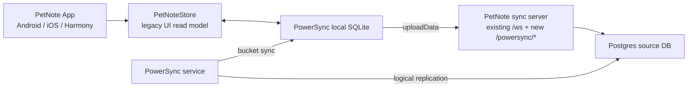

# PowerSync Spike Plan

## Objective

This spike checks whether PetNote can move from encrypted whole-state relay sync
to a table-based offline-first sync model without breaking Android, iOS, and
HarmonyOS in the same repository.

The current main workspace is intentionally untouched. All work lives in the
isolated worktree:

```text
/Volumes/Data/Projects/PetNote-powersync-spike
```

## Non-Goals

- Do not replace the production sync deployment on `8.138.24.105`.
- Do not replace the existing `/ws` pairing, signaling, snapshot, action, RTC
  token, or device relay paths.
- Do not make PowerSync the default sync engine.
- Do not migrate UI reads away from `PetNoteStore` in this spike.
- Do not commit local signing material, build artifacts, database volumes, or
  Docker runtime state.

## Current Architecture Anchor

PetNote already has a good data boundary:

- UI reads from `PetNoteStore`.
- Export/import uses `PetNoteDataState`.
- Legacy device sync exchanges encrypted data snapshots and actions through the
  PetNote sync server.

This spike keeps that boundary. PowerSync rows are mapped into
`PetNoteDataState`, and local PetNote mutations can be represented as table
rows before the UI storage model is rewritten.

## Proposed Runtime Shape



## Isolated Docker Stack

The spike adds a separate compose file that can run locally or on the current
server as an isolated test stack:

```bash
docker compose -f server/docker-compose.powersync.yml config
```

Services:

- `postgres`: local source database and PowerSync storage database.
- `petnote-sync`: existing Dart server, extended with `/powersync/credentials`
  and `/powersync/upload`.
- `powersync-service`: self-hosted PowerSync service using the local Postgres
  source.

This does not modify `server/docker-compose.yml`.

Host ports are intentionally separated from production and bound to loopback
only:

- PetNote production sync keeps `8787`.
- PowerSync spike `petnote-sync` publishes `127.0.0.1:18787`.
- PowerSync service publishes `127.0.0.1:18080`.
- Spike Postgres publishes `127.0.0.1:15432`.

The spike compose uses separate Docker volumes and must be started with
`server/docker-compose.powersync.yml`, never with the production compose file.
For networks where Docker Hub is slow, the compose file accepts
`POSTGRES_IMAGE` and `POWERSYNC_IMAGE` overrides.
It also pins the Compose project name to `petnote-powersync-spike` so container
names and volumes cannot collide with the existing production `server` project.
The app-server and PowerSync Postgres URLs include `sslmode=disable` because
the spike Postgres service is an internal Docker-network database without TLS.

## Data Tables

Core source tables for the first experiment:

- `pets`
- `todos`
- `reminders`
- `records`
- `devices`
- `pet_photo_assets`
- `powersync_client_ops`

All user content tables include:

- `id`
- `household_id`
- `payload_json`
- `updated_at_ms`
- `deleted_at_ms`
- `owner_device_id`
- `role_priority`

`payload_json` keeps compatibility with the existing model JSON while the
experiment validates PowerSync transport and conflict handling. If the spike
passes all platform gates, a later branch can normalize frequently queried
columns.

## Server Endpoints

### `POST /powersync/credentials`

Request body:

```json
{
  "householdId": "household-1",
  "authToken": "household-auth-token",
  "deviceId": "device-1",
  "role": "owner"
}
```

Response body:

```json
{
  "endpoint": "http://localhost:8080",
  "token": "<short lived JWT>",
  "user_id": "device-1",
  "expires_at_ms": 1780000000000
}
```

Authentication reuses the existing household auth token and registered device
list. The JWT contains `sub`, `household_id`, `device_id`, `role`, `iat`, and
`exp`.

### `POST /powersync/upload`

Request body:

```json
{
  "householdId": "household-1",
  "authToken": "household-auth-token",
  "deviceId": "device-1",
  "role": "owner",
  "operations": [
    {
      "op_id": 1,
      "op": "PUT",
      "type": "pets",
      "id": "pet-1",
      "tx_id": 1,
      "data": {
        "household_id": "household-1",
        "payload_json": "{\"id\":\"pet-1\"}",
        "updated_at_ms": 1780000000000
      }
    }
  ]
}
```

The server derives idempotency from `deviceId + op_id + type + id`. Duplicate
uploads do not apply twice.

## Conflict Policy for Spike

The source database stores `role_priority`:

- owner: `20`
- pet: `10`
- unknown: `0`

If two devices write the same row with the same or older timestamp, the higher
role priority wins. This is intentionally conservative and observable. A later
production design should define per-entity merge rules.

## Avatar and Attachment Scope

The first table pass tracks avatar metadata, not binary file blobs:

- `pets.payload_json.photoPath`
- `pet_photo_assets.payload_json`

Actual image bytes still require an attachment channel or object storage. The
spike keeps metadata synchronized so the UI can resolve already available local
files and identify missing assets deterministically.

## Platform Gates

Minimum checks before considering this spike viable:

```bash
flutter test test/sync/powersync
cd server && dart test test/powersync_server_test.dart
flutter build apk --release --target-platform android-arm64 --no-tree-shake-icons
flutter build ios --release --no-codesign
powershell -ExecutionPolicy Bypass -File ./scripts/flutter-ohos.ps1 -Mode build -TargetPlatform x64
```

If OHOS Flutter cannot compile the PowerSync native dependency set, the spike
must stop and record the incompatibility. It should not hide the issue behind
conditional imports that still leave mainline three-end builds fragile.

## Server Closure Requirements

Before the migration is considered closed-loop, verify on the isolated server
stack:

- Existing production `server/docker-compose.yml` container remains up.
- `curl http://127.0.0.1:18787/healthz` returns `ok`.
- `POST /powersync/credentials` returns a short-lived JWT for a registered
  household device.
- `POST /powersync/upload` can insert/update/delete rows in Postgres.
- Repeating the same `client_op_id` is skipped and does not apply twice.
- Owner writes win over pet writes at the same timestamp.
- PowerSync service starts or records a concrete config/runtime blocker.

## Open Questions

- Whether PowerSync self-hosted service config should use Sync Streams only, or
  retain legacy sync rules for the first self-hosted experiment.
- Whether binary avatar sync should use PowerSync Attachments, server-side
  object storage, or the existing encrypted sync packet side channel.
- Whether conflict policy should stay timestamp + role priority, or move to
  per-field merge rules for todos/reminders.
